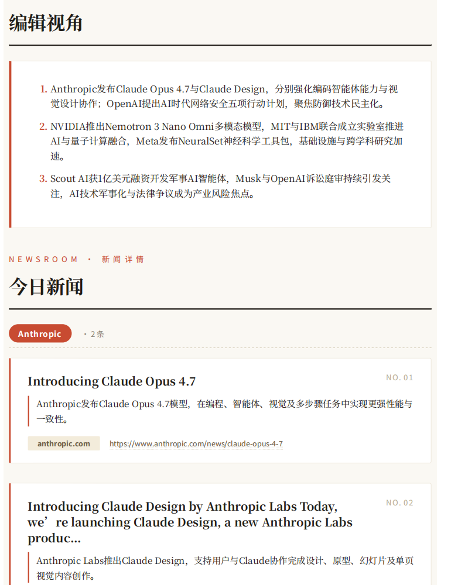
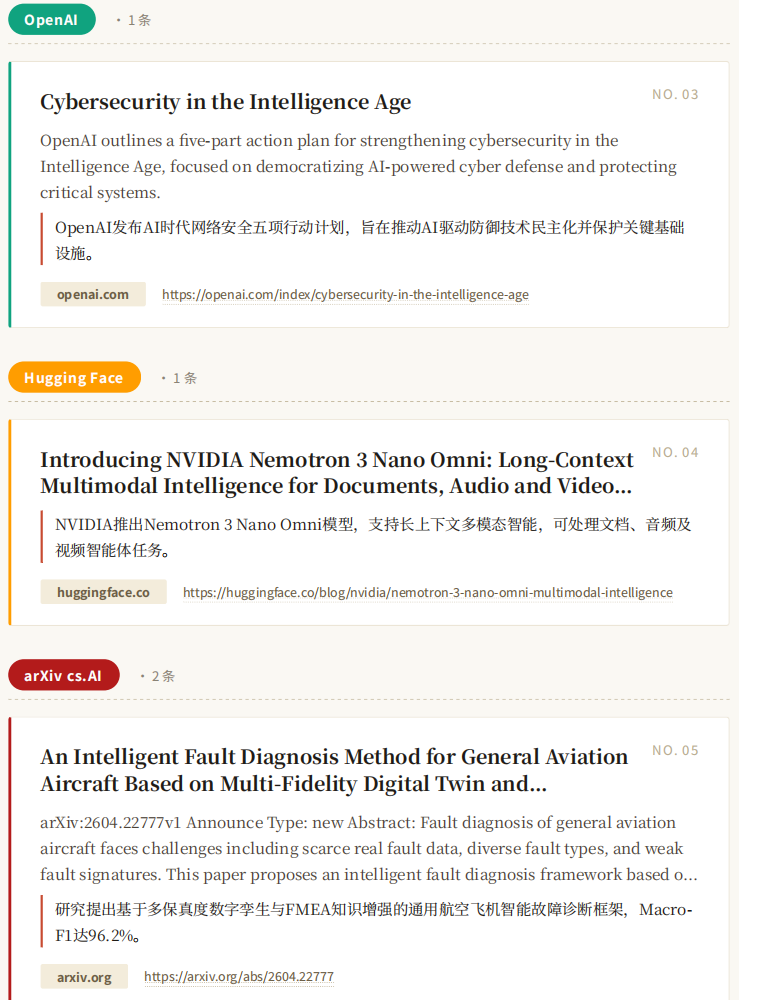
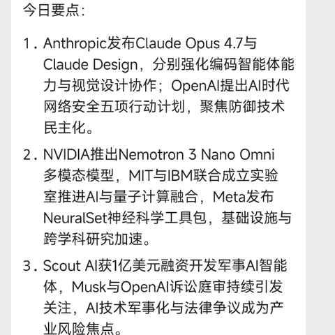
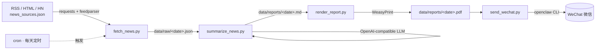
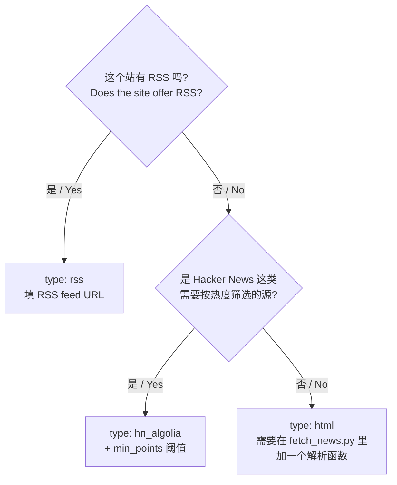
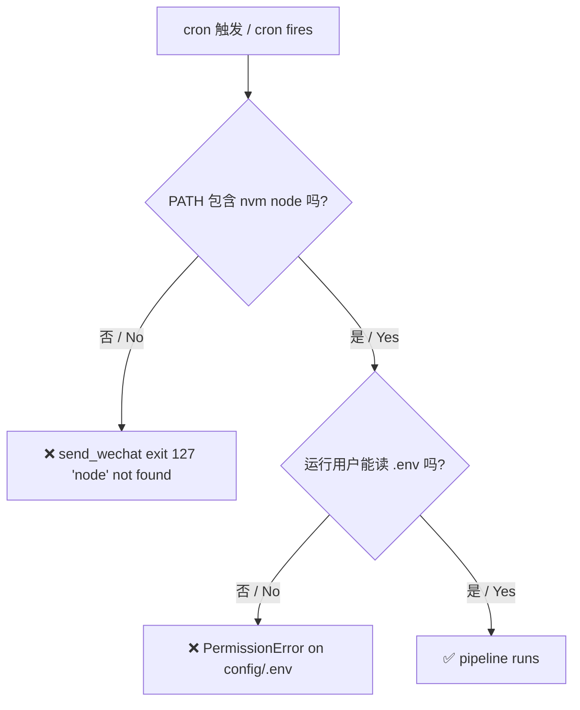

# Everyday-AInews-in-Openclaw · 微信 AI 新闻日报机器人 / WeChat AI News Daily Bot

> 每天定时抓取主流 AI 新闻 → LLM 生成中文日报 → 渲染 PDF → 通过 [OpenClaw](https://openclaw.com) CLI 自动推送到微信。
>
> Daily pipeline: fetch AI news → summarize into a Chinese report via LLM → render PDF → push to WeChat through the OpenClaw CLI.

---

<table>
  <tr>
    <td align="center" width="25%"></td>
    <td align="center" width="25%"></td>
    <td align="center" width="25%"></td>
    <td align="center" width="25%"></td>
  </tr>
  <tr>
    <td align="center"><sub>封面 / Cover</sub></td>
    <td align="center"><sub>今日要点 / Highlights</sub></td>
    <td align="center"><sub>新闻详情 / Details</sub></td>
    <td align="center"><sub>微信实际推送 / WeChat delivery</sub></td>
  </tr>
</table>

## 目录 / Table of Contents

- [1. 整体架构 / Architecture](#1-整体架构--architecture)
- [2. 快速安装 / Quick Install](#2-快速安装--quick-install)
- [3. 增/删/换新闻源 / Manage News Sources](#3-增删换新闻源--manage-news-sources)
- [4. 数据流与脚本 / Data Flow & Scripts](#4-数据流与脚本--data-flow--scripts)
- [5. 手动运行与调试 / Manual Run & Debug](#5-手动运行与调试--manual-run--debug)
- [6. 报告格式 / Report Format](#6-报告格式--report-format)
- [7. 常见问题 / Troubleshooting](#7-常见问题--troubleshooting)

---

## 1. 整体架构 / Architecture

**为什么做这个项目？** 日常想保持对 AI 圈进展的感知，但每天打开十几个 RSS / 博客太碎。希望机器自动把当日值得看的内容汇总成一份**中文日报 + PDF**，按时推送到微信。

**Why this project?** Stay up-to-date with the AI ecosystem without scanning a dozen RSS feeds every day. The bot aggregates the day's signal, summarizes it in Chinese, renders a PDF, and delivers it to WeChat at a fixed time.



四步串成一条流水线，由 `run_pipeline.py` 统一调度，cron 每天触发一次。

Four steps chained by `run_pipeline.py`, triggered by cron once per day.

---

## 2. 快速安装 / Quick Install

整个项目可以用一条脚本搞定。前置：Python 3.11+、Node.js（用于 `openclaw` CLI，推荐 nvm）、Linux 上 WeasyPrint 系统库。

The whole project installs via a single script. Prerequisites: Python 3.11+, Node.js (for the `openclaw` CLI, nvm recommended), and the WeasyPrint system libs on Linux.

```bash
# 1) 准备部署目录与代码 / Lay out the deployment dir
mkdir -p ~/ai-news-bot && cd ~/ai-news-bot
git clone git@github.com:WangZetian-IVERSON/Everyday-AInews-in-Openclaw.git tmp
mv tmp/repo ./repo && mv tmp/data ./data 2>/dev/null || true
rm -rf tmp

# 2) 一条命令完成 venv / 依赖 / config/.env / crontab
#    One shot: venv + Python deps + config/.env + daily crontab
bash repo/install.sh
#   bash repo/install.sh --no-cron   # 跳过 cron / skip crontab
#   bash repo/install.sh --force     # 覆盖已有 .env / overwrite existing .env
```

脚本完成后再做三件事 / After it finishes, three steps remain:

1. **填密钥 / Fill secrets**：编辑 `config/.env`，至少填 `OPENAI_API_KEY`、`MODEL_ID`、`OPENCLAW_CHANNEL`，以及 `WECHAT_TARGET_ID`（单聊）或 `WECHAT_FANOUT`（多账号/多目标）。字段说明见 [`repo/.env.example`](repo/.env.example) 与 [`repo/README.md`](repo/README.md)。
2. **登录微信 / Log in to WeChat**：`openclaw channels login --channel openclaw-weixin`，扫码一次即可。后续可用 `openclaw channels status --probe` 检查。
3. **干跑验证 / Dry-run**：`venv/bin/python -m src.run_pipeline --dry-run`，确认抓取/总结/渲染都能跑通后，等当天定时触发即可。

> `install.sh` 是幂等的：venv 已存在不会重建、`.env` 已存在不会覆盖、crontab 已注册不会重复添加。
>
> `install.sh` is idempotent: it skips an existing venv/.env, and won't add a duplicate cron entry.

部署后的目录 / Resulting layout:

```
ai-news-bot/
├── config/.env                  # 私密配置 mode 600 / secrets, mode 600
├── venv/                        # Python 虚拟环境 / virtualenv
├── data/
│   ├── raw/<date>.json          # 抓取原始条目 / raw items
│   ├── reports/<date>.md/.pdf   # 当日报告 / daily report
│   ├── state/<date>.sent        # 已发送标记 / sent marker
│   └── logs/{cron,pipeline}.*   # 日志 / logs
└── repo/                        # 代码（来自 GitHub）/ code from GitHub
```

---

## 3. 增/删/换新闻源 / Manage News Sources

新闻源全部集中在 [`repo/news_sources.json`](repo/news_sources.json)：

All sources live in a single JSON file:

```json
{
  "sources": [
    { "name": "openai_blog",    "url": "https://openai.com/blog/rss.xml",         "type": "rss" },
    { "name": "anthropic_news", "url": "https://www.anthropic.com/news",          "type": "html" },
    { "name": "hn_ai",          "url": "https://hn.algolia.com/api/v1/search?...","type": "hn_algolia", "min_points": 50 }
  ]
}
```

### 字段 / Fields

| 字段 / Field | 必填 | 含义 / Meaning |
|---|---|---|
| `name` | ✅ | 内部唯一标识，会出现在报告「来源」一行 / Unique id, shown as the source label |
| `url` | ✅ | 拉取 URL / Endpoint to fetch |
| `type` | ✅ | `rss` \| `html` \| `hn_algolia` |
| `min_points` | ❌ | 仅 `hn_algolia` 生效，最低分阈值 / HN-only score threshold |

### 三种类型怎么选 / Which type to use



- **rss**：通用 RSS / Atom，`feedparser` 解析，自带 24h cutoff 与去重，**99% 的源都用这个**。
- **html**：目前只对 Anthropic 官网做了一个 BeautifulSoup 解析。新加 HTML 站需要在 [`fetch_news.py`](repo/src/fetch_news.py) 写 `fetch_xxx_html()` 并在 dispatch 里加 `type` 分支。
- **hn_algolia**：HN Algolia 搜索 API，按 `min_points` 过滤高分故事。

加完保存即可生效，先 `python -m src.fetch_news --date $(date -I)` 看 `data/raw/<date>.json` 里有没有新条目。

Save and it takes effect immediately. Run `python -m src.fetch_news --date $(date -I)` and check `data/raw/<date>.json` for entries from the new source.

---

## 4. 数据流与脚本 / Data Flow & Scripts

| 脚本 / Script | 输入 | 输出 | 备注 |
|---|---|---|---|
| [`fetch_news.py`](repo/src/fetch_news.py) | `news_sources.json` | `data/raw/<date>.json` | 支持 `rss` / `html` / `hn_algolia`；24h cutoff + 标题去重 |
| [`summarize_news.py`](repo/src/summarize_news.py) | `<date>.json` | `<date>.md` | **单次** LLM 调用返回 `{key_points, risks, items[]}`；失败走 `_fallback_report` |
| [`render_report.py`](repo/src/render_report.py) | `<date>.md` | `<date>.html`, `<date>.pdf` | WeasyPrint 渲染，自带中文字体样式 |
| [`send_wechat.py`](repo/src/send_wechat.py) | `<date>.md`, `<date>.pdf` | 微信消息 + `state/<date>.sent` | 调 `openclaw` CLI；`--dry-run` / `--no-pdf` 可选；支持 `WECHAT_FANOUT` 多账号 |
| [`run_pipeline.py`](repo/src/run_pipeline.py) | — | — | 顺序调度上述四步 |

每一步都向 `data/logs/pipeline.jsonl` 追加一行结构化日志：

```json
{"ts":"2026-04-29T20:57:19+08:00","run_id":"...","step":"summarize_news","status":"success","elapsed_ms":54453,"error":""}
```

---

## 5. 手动运行与调试 / Manual Run & Debug

```bash
# 跑完整流水线 / full pipeline
sudo -u wangzetian1 bash -lc '
  export PATH=$HOME/.nvm/versions/node/v24.15.0/bin:$PATH
  cd ~/ai-news-bot && source venv/bin/activate
  cd repo && python -m src.run_pipeline
'

# 单步重跑指定日期 / rerun a single step
DATE=2026-04-29
python -m src.fetch_news      --date $DATE
python -m src.summarize_news  --date $DATE
python -m src.render_report   --date $DATE
python -m src.send_wechat     --date $DATE

# 不真发，仅生成日志 / dry run
python -m src.send_wechat --date $DATE --dry-run

# 仅文本不带 PDF / text only
python -m src.send_wechat --date $DATE --no-pdf

# 重发当天（先删 sent 标记）/ resend today
rm ~/ai-news-bot/data/state/$DATE.sent
python -m src.send_wechat --date $DATE
```

实时排查 / Live debugging：

```bash
tail -f ~/ai-news-bot/data/logs/cron.log         # 标准输出 / stdout
tail -f ~/ai-news-bot/data/logs/pipeline.jsonl   # 结构化 / structured
```

---

## 6. 报告格式 / Report Format

`summarize_news.py` 单次 LLM 调用返回结构化 JSON，渲染出固定模板：

A single LLM call returns structured JSON, then the script assembles a fixed template:

```
标题：AI 新闻日报 - YYYY-MM-DD

今日要点：                       # 3 条综合要点 / 3 synthesized highlights
1. ...

新闻详情：                       # Per-item details
1. 标题：...                     # Title
   来源：...                     # Source
   链接：...                     # URL
   摘要：...                     # 原文摘要 / original-language summary
   中文摘要：...                  # LLM 中文摘要 / LLM zh summary

风险与不确定性：                  # Risks & uncertainties
- ...

信息来源：                       # Deduplicated source list
- ...
```

LLM 失败时走 `_fallback_report`：仅输出标题 + 链接列表，不阻塞推送。

If the LLM fails, `_fallback_report` produces a titles-only digest so the push is never blocked.

---

## 7. 常见问题 / Troubleshooting



`install.sh` 注册 cron 时会自动把 nvm 的 node 目录写进 `PATH`，且默认让 `.env` 属主跑流水线，因此上面两个最常见的坑通常已经规避。如果仍有问题：

`install.sh` already prepends the nvm node dir to `PATH` in the cron line and runs the pipeline as the `.env` owner, so the two pitfalls above are normally avoided. For other issues:

| 现象 / Symptom | 原因 / Cause | 处理 / Fix |
|---|---|---|
| `PermissionError: .../config/.env` | 不是 `.env` 属主 / not the owner | `sudo -u <owner> ...` |
| `summarize_news status=fallback`，error=`OPENAI_API_KEY is empty` | `.env` 未读到或 key 为空 | 检查 `.env` 路径、属主、内容 |
| `send_wechat exit_code=127 ... 'node': No such file` | PATH 缺 nvm node | `export PATH=$HOME/.nvm/versions/node/<ver>/bin:$PATH` |
| 微信日志 success 但收不到 / log says success, WeChat shows nothing | OpenClaw 账号 / 目标 ID 配错 | 用 CLI 直发 `--target filehelper` 验证 |
| 当天重复推送被跳过 / duplicate push skipped | `data/state/<date>.sent` 已存在 | `rm` 该文件后重跑 |
| `WeasyPrint` 报字体或 cairo 错误 | 系统库缺失 | `sudo apt-get install -y libpango-1.0-0 libpangoft2-1.0-0 libcairo2 libgdk-pixbuf-2.0-0 fonts-noto-cjk` |
| 新加的 RSS 源没条目 | 24h cutoff 过滤 / cutoff filtered them | 浏览器看 feed 是否真的有近 24h 内的更新 |

更细的字段说明、备用 HTTP 模式与 fanout 写法见 [`repo/README.md`](repo/README.md) 和 [`repo/.env.example`](repo/.env.example)。

For per-field reference, the HTTP fallback mode, and fanout syntax, see [`repo/README.md`](repo/README.md) and [`repo/.env.example`](repo/.env.example).

---

## License

仅供个人 / 内部使用。本仓库不附带 OpenClaw / 各新闻源的任何许可，请遵守对应服务条款。

For personal / internal use only. This repo bundles no licenses for OpenClaw or any news source — comply with their respective ToS.
