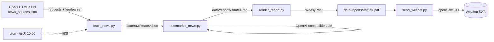
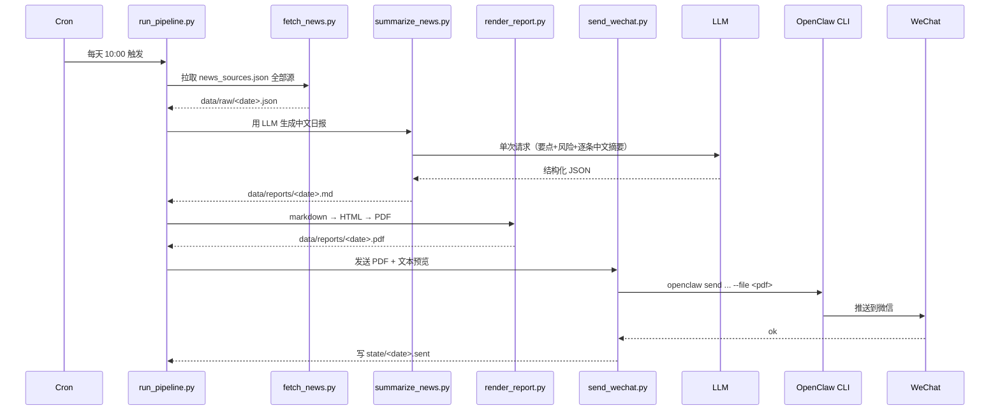
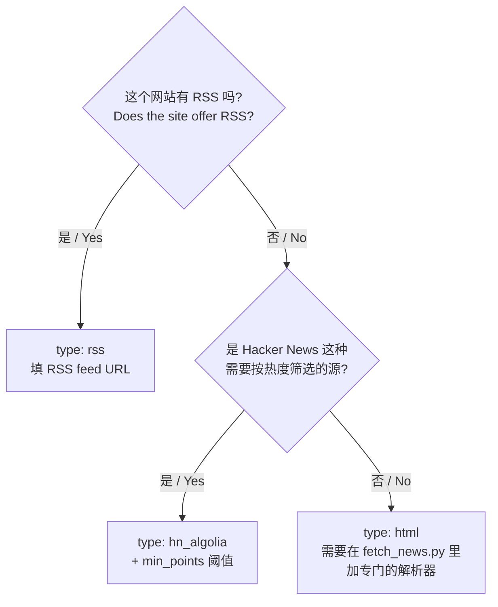
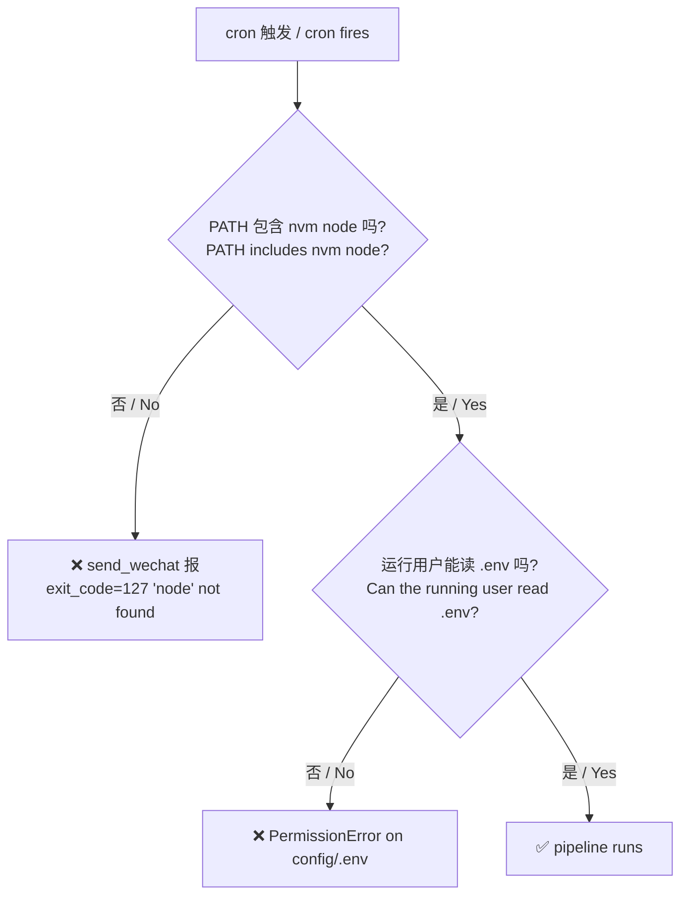

# everyday_AInews · 微信 AI 新闻日报机器人 / WeChat AI News Daily Bot

> 每天定时抓取主流 AI 新闻 → LLM 生成中文日报 → 渲染 PDF → 通过 [OpenClaw](https://openclaw.com) CLI 自动推送到微信。
>
> Daily pipeline: fetch AI news → summarize into a Chinese report via LLM → render PDF → push to WeChat through the OpenClaw CLI.

---

## 目录 / Table of Contents

- [1. 项目背景与整体架构 / Background & Architecture](#1-项目背景与整体架构--background--architecture)
- [2. OpenClaw 安装与登录 / Install & Login OpenClaw](#2-openclaw-安装与登录--install--login-openclaw)
- [3. 项目初始化 / Project Setup](#3-项目初始化--project-setup)
- [4. 四个脚本与数据流 / The Four Scripts & Data Flow](#4-四个脚本与数据流--the-four-scripts--data-flow)
- [5. 增/删/换新闻源 / Manage News Sources](#5-增删换新闻源--manage-news-sources)
- [6. Cron 部署 / Cron Deployment](#6-cron-部署--cron-deployment)
- [7. 手动运行与调试 / Manual Run & Debug](#7-手动运行与调试--manual-run--debug)
- [8. 报告格式 / Report Format](#8-报告格式--report-format)
- [9. 常见问题 / Troubleshooting](#9-常见问题--troubleshooting)

---

## 1. 项目背景与整体架构 / Background & Architecture

**为什么做这个项目？**
日常想保持对 AI 圈进展的感知，但每天打开十几个 RSS / 博客太碎。希望机器自动把当日值得看的内容汇总成一份**中文日报 + PDF**，按时推送到微信。

**Why this project?** Stay up-to-date with the AI ecosystem without scanning a dozen RSS feeds every day. The bot aggregates the day's signal, summarizes it in Chinese, renders a PDF, and delivers it to WeChat at a fixed time.

### 整体架构 / Architecture



四步串成一条流水线，由 `run_pipeline.py` 统一调度，cron 每天触发一次。

Four steps chained by `run_pipeline.py`, triggered by cron once per day.

---

## 2. OpenClaw 安装与登录 / Install & Login OpenClaw

本项目把消息发送这一步**完全外包**给 OpenClaw —— 它提供一个本地 CLI，可以把指定的微信消息（文本 / 文件）发到指定目标。

This project fully delegates message delivery to OpenClaw — a local CLI that can send WeChat messages (text / file attachments) to a target ID.

### 2.1 安装 OpenClaw CLI / Install the CLI

OpenClaw 通过 npm 全局安装，需要 Node.js ≥ 18（项目实测 v24.x）。强烈建议用 [`nvm`](https://github.com/nvm-sh/nvm)。

OpenClaw is distributed via npm and requires Node.js ≥ 18 (tested on v24.x). Use [`nvm`](https://github.com/nvm-sh/nvm).

```bash
# 1) 安装 nvm + Node / Install nvm + Node
curl -o- https://raw.githubusercontent.com/nvm-sh/nvm/v0.39.7/install.sh | bash
exec $SHELL -l
nvm install --lts

# 2) 安装 openclaw CLI / Install the openclaw CLI
npm install -g openclaw

# 3) 验证 / Verify
which openclaw         # → /home/<user>/.nvm/versions/node/<ver>/bin/openclaw
openclaw --version
```

### 2.2 登录 / Login & Bind WeChat

```bash
# 启动登录流程 / Start the login flow
openclaw login

# 绑定微信账号（按提示扫码） / Bind your WeChat account by scanning the QR
openclaw account add --channel openclaw-weixin
```

绑定完成后，记录两个值，稍后写入 `.env`：

After binding, record two values for `.env`:

| 字段 / Field | 含义 / Meaning | 如何获取 / How to get |
|---|---|---|
| `OPENCLAW_ACCOUNT` | 你的 OpenClaw 账号 ID / your OpenClaw account ID | `openclaw account list` |
| `WECHAT_TARGET_ID` | 接收方微信 ID / target WeChat ID (个人 / 群 / 文件传输助手) | `openclaw contact list` |

> 测试小技巧 / Tip：先发到「文件传输助手」(`filehelper`) 验证链路，再换成正式接收人。
> Test against the "File Helper" first, then switch to the real recipient.

### 2.3 命令行手动测试 / Smoke Test from CLI

```bash
openclaw send \
  --channel openclaw-weixin \
  --account "$OPENCLAW_ACCOUNT" \
  --target  "$WECHAT_TARGET_ID" \
  --text    "hello from openclaw"
```

收到消息即说明 CLI 已就绪，本项目可以直接调用它。

If the message arrives, the CLI is ready and this project can drive it.

---

## 3. 项目初始化 / Project Setup

### 3.1 克隆与目录约定 / Clone & Layout

仓库本身只放代码与历史报告；运行态产物（venv / 抓取数据 / 日志 / .env）放在仓库**外**的部署目录中，以下示例以 `/home/wangzetian1/ai-news-bot/` 为运行目录。

The repo only ships code + historical reports. Runtime artifacts (venv / raw / logs / `.env`) live **outside** the repo, in a deployment directory (example: `/home/wangzetian1/ai-news-bot/`).

```bash
# 在部署用户家目录下 / In your deployment user's home
mkdir -p ~/ai-news-bot && cd ~/ai-news-bot
git clone git@github.com:WangZetian-IVERSON/everyday_AInews.git tmp_clone
mv tmp_clone/repo ./repo
mv tmp_clone/data ./data        # 历史报告（可选）/ historical reports (optional)
rm -rf tmp_clone
mkdir -p config data/raw data/state data/logs data/reports
```

部署后的目录结构 / Resulting layout:

```
ai-news-bot/
├── config/.env                  # 私密配置（mode 600） / secrets (mode 600)
├── venv/                        # Python 虚拟环境 / virtualenv
├── data/
│   ├── raw/<date>.json          # 抓取原始条目 / raw items
│   ├── reports/<date>.md/.pdf   # 当日报告 / daily report
│   ├── state/<date>.sent        # 已发送标记 / sent marker
│   └── logs/pipeline.jsonl      # 结构化日志 / structured log
└── repo/                        # 代码（来自 GitHub） / code from GitHub
    ├── src/                     # fetch / summarize / render / send / pipeline
    ├── prompts/
    ├── news_sources.json
    └── requirements.txt
```

### 3.2 Python 环境 / Python Environment

```bash
cd ~/ai-news-bot
python3 -m venv venv
source venv/bin/activate
pip install -r repo/requirements.txt
```

主要依赖 / Key deps：`openai`, `feedparser`, `requests`, `beautifulsoup4`, `python-dotenv`, `weasyprint`, `tenacity`。

> WeasyPrint 在 Linux 上需要系统库：
> WeasyPrint needs system libs on Linux:
> ```bash
> sudo apt-get install -y libpango-1.0-0 libpangoft2-1.0-0 libharfbuzz0b libfribidi0 fonts-noto-cjk
> ```

### 3.3 配置 `.env` / Configure `.env`

复制模板 / Copy the template：

```bash
cp repo/.env.example config/.env
chmod 600 config/.env       # 仅属主可读 / owner-readable only
```

编辑 `config/.env`：

```ini
# ===== LLM =====
# 任意 OpenAI 兼容端点（Fireworks / OpenRouter / DeepSeek / vLLM ...）
# Any OpenAI-compatible endpoint
OPENAI_API_KEY=sk-...
OPENAI_BASE_URL=https://api.fireworks.ai/inference/v1
MODEL_ID=fw_JTEMiPhkR8hjPEEx663tRH
MAX_OUTPUT_TOKENS=1200
MAX_INPUT_CHARS=20000
MAX_NEWS_ITEMS=20

# ===== WeChat / OpenClaw =====
OPENCLAW_SEND_MODE=cli
OPENCLAW_CLI_BIN=openclaw
OPENCLAW_CHANNEL=openclaw-weixin
OPENCLAW_ACCOUNT=<your_openclaw_account>
WECHAT_TARGET_ID=<wechat_id_or_filehelper>

# ===== Runtime =====
TZ=Asia/Shanghai
SEND_HOUR=22
SEND_MINUTE=0
```

> ⚠️ **`OPENAI_API_KEY` 只是变量名**。代码用的是 `openai` 这个 SDK，它兼容任何遵守 OpenAI 协议的服务。要切到 OpenRouter，把 `BASE_URL` 改成 `https://openrouter.ai/api/v1`、`MODEL_ID` 改成 OpenRouter 的模型 id 即可，不用改代码。
>
> The variable is just a name. The SDK speaks OpenAI's protocol; switch endpoints by changing `OPENAI_BASE_URL` and `MODEL_ID` only — no code change.

---

## 4. 四个脚本与数据流 / The Four Scripts & Data Flow



各脚本职责 / Per-script responsibilities：

| 脚本 / Script | 输入 / Input | 输出 / Output | 备注 / Notes |
|---|---|---|---|
| [`fetch_news.py`](repo/src/fetch_news.py) | `news_sources.json` | `data/raw/<date>.json` | 支持 `rss` / `html`（Anthropic 专用） / `hn_algolia` 三种类型；按 24h cutoff + 标题去重 |
| [`summarize_news.py`](repo/src/summarize_news.py) | `data/raw/<date>.json` | `data/reports/<date>.md` | **单次** LLM 调用直接返回 `{key_points, risks, items[]}` JSON；失败走 `_fallback_report` |
| [`render_report.py`](repo/src/render_report.py) | `<date>.md` | `<date>.html`, `<date>.pdf` | WeasyPrint 渲染；自带中文字体样式 |
| [`send_wechat.py`](repo/src/send_wechat.py) | `<date>.md`, `<date>.pdf` | 微信消息 + `state/<date>.sent` | 调 `openclaw` CLI；`--dry-run` 不真发，`--no-pdf` 仅文本 |
| [`run_pipeline.py`](repo/src/run_pipeline.py) | — | — | 顺序调度上述四步，任一步失败不阻断后续步骤 |

每一步都会向 `data/logs/pipeline.jsonl` 追加一行：

Each step appends one JSON line to `data/logs/pipeline.jsonl`:

```json
{"ts":"2026-04-29T20:57:19+08:00","run_id":"...","step":"summarize_news","status":"success","elapsed_ms":54453,"error":""}
```

---

## 5. 增/删/换新闻源 / Manage News Sources

新闻源全部集中在一个 JSON 文件里：

All sources live in a single JSON file:

📄 [`repo/news_sources.json`](repo/news_sources.json)

```json
{
  "sources": [
    { "name": "openai_blog", "url": "https://openai.com/blog/rss.xml", "type": "rss" },
    { "name": "anthropic_news", "url": "https://www.anthropic.com/news",  "type": "html" },
    { "name": "hn_ai", "url": "https://hn.algolia.com/api/v1/search?...", "type": "hn_algolia", "min_points": 50 }
  ]
}
```

### 5.1 字段说明 / Fields

| 字段 / Field | 必填 / Required | 含义 / Meaning |
|---|---|---|
| `name` | ✅ | 内部唯一标识，会出现在报告「来源」一行 / Unique id, shown as the source label |
| `url` | ✅ | 拉取 URL / Endpoint to fetch |
| `type` | ✅ | `rss` \| `html` \| `hn_algolia` |
| `min_points` | ❌ | 仅对 `hn_algolia` 生效，最低分阈值 / HN-only score threshold |

### 5.2 三种类型何时用 / When to pick which type



- **rss / `fetch_rss_source`**：通用 RSS / Atom，用 `feedparser` 解析，自带 24h cutoff 与去重，**99% 的源都用这个**。
- **html / `fetch_anthropic_html`**：目前只对 Anthropic 官网做了一个简单 BeautifulSoup 解析。要新加一个 HTML 站，需要在 [`fetch_news.py`](repo/src/fetch_news.py) 里写对应的 `fetch_xxx_html()` 并在 dispatch 处加分支。
- **hn_algolia / `fetch_hn_algolia`**：调用 HN 的 Algolia 搜索 API，按 `min_points` 过滤高分故事。

### 5.3 增加一个 RSS 源（最常见）/ Add an RSS source

```diff
 {
   "sources": [
     { "name": "openai_blog", "url": "https://openai.com/blog/rss.xml", "type": "rss" },
+    { "name": "google_research_blog",
+      "url": "https://blog.research.google/feeds/posts/default",
+      "type": "rss" },
     { "name": "anthropic_news", "url": "https://www.anthropic.com/news", "type": "html" }
   ]
 }
```

保存后立即生效，不用重启任何服务。立即试一下 / Test immediately：

```bash
sudo -u wangzetian1 bash -lc '
  cd ~/ai-news-bot && source venv/bin/activate && cd repo
  python -m src.fetch_news --date $(date -I)
'
# 然后看 data/raw/<date>.json 里是否出现新 source 的条目
# Then check data/raw/<date>.json for entries from the new source
```

### 5.4 删除 / 暂停一个源 / Remove or pause a source

直接从 `sources` 数组里删掉即可。如果只是想**临时关掉**，加一个开关字段（代码会忽略未知字段）：

Just delete the entry. To temporarily disable a source without losing the URL:

```json
{ "name": "venturebeat_ai", "url": "...", "type": "rss", "_disabled": true }
```

> 当前代码不读 `_disabled`，但只要把 `type` 写成不存在的值（比如 `disabled`），dispatch 会跳过它。
> Or set `type: "disabled"` — unknown types are skipped.

### 5.5 加一个全新类型（HTML 抓取）/ Add a brand-new source type

在 [`fetch_news.py`](repo/src/fetch_news.py) 里：

In `fetch_news.py`:

1. 实现 `fetch_<name>_html(source)`，返回 `[{title, url, source, published_at, summary}]`。
2. 在 `run()` 的 dispatch 里加分支：

```python
elif source.get("name") == "your_site":
    source_items = fetch_your_site_html(source)
```

3. 在 `news_sources.json` 添加 `{ "name": "your_site", "url": "...", "type": "html" }`。

---

## 6. Cron 部署 / Cron Deployment

### 6.1 安装 crontab / Install

以**真正能读 `.env` 的用户**安装 cron（本项目是 `wangzetian1`）：

Install cron under the user who **owns** `.env` (here: `wangzetian1`):

```bash
sudo -u wangzetian1 crontab -e
```

写入 / Add：

```cron
0 10 * * * export PATH="/home/wangzetian1/.nvm/versions/node/v24.15.0/bin:/usr/local/sbin:/usr/local/bin:/usr/sbin:/usr/bin:/sbin:/bin"; \
  cd /home/wangzetian1/ai-news-bot/repo && \
  echo "[cron trigger] $(date -Is)" >> /home/wangzetian1/ai-news-bot/data/logs/cron.log && \
  /home/wangzetian1/ai-news-bot/venv/bin/python -m src.run_pipeline \
  >> /home/wangzetian1/ai-news-bot/data/logs/cron.log 2>&1
```

### 6.2 两个最常踩的坑 / Two common pitfalls



- **PATH 必须显式 `export`**：cron 默认 PATH 极简，不含 `~/.nvm/...`，所以必须在命令开头 `export PATH=...nvm/.../bin:...`。
  cron has a minimal PATH; you **must** prepend the nvm bin dir.
- **必须由 `.env` 属主运行**：`config/.env` 是 `600` 权限，只有属主能读。手动测试时记得 `sudo -u <owner>`。
  `.env` is `600` — only the owner can read it. Use `sudo -u <owner>` for manual runs.

### 6.3 查看 cron 历史 / View cron logs

```bash
tail -f /home/wangzetian1/ai-news-bot/data/logs/cron.log        # 标准输出 / stdout
tail -f /home/wangzetian1/ai-news-bot/data/logs/pipeline.jsonl  # 结构化 / structured
```

---

## 7. 手动运行与调试 / Manual Run & Debug

```bash
# === 跑完整流水线 / full pipeline ===
sudo -u wangzetian1 bash -lc '
  export PATH=$HOME/.nvm/versions/node/v24.15.0/bin:$PATH
  cd ~/ai-news-bot && source venv/bin/activate
  cd repo && python -m src.run_pipeline
'

# === 单步重跑（指定日期）/ rerun a single step ===
sudo -u wangzetian1 bash -lc '
  cd ~/ai-news-bot && source venv/bin/activate && cd repo
  DATE=2026-04-29
  python -m src.fetch_news      --date $DATE
  python -m src.summarize_news  --date $DATE
  python -m src.render_report   --date $DATE
  python -m src.send_wechat     --date $DATE
'

# === 不真发，仅生成日志 / dry run ===
python -m src.send_wechat --date 2026-04-29 --dry-run

# === 仅发文本，不带 PDF / text only ===
python -m src.send_wechat --date 2026-04-29 --no-pdf

# === 重发当天（先删 sent 标记）/ resend today ===
rm /home/wangzetian1/ai-news-bot/data/state/2026-04-29.sent
python -m src.send_wechat --date 2026-04-29
```

---

## 8. 报告格式 / Report Format

`summarize_news.py` 单次 LLM 调用返回结构化 JSON，渲染出固定模板：

A single LLM call returns structured JSON, then the script assembles a fixed template:

```
标题：AI 新闻日报 - YYYY-MM-DD

今日要点：                       # 3 条综合要点 / 3 synthesized highlights
1. ...
2. ...
3. ...

新闻详情：                       # Per-item details
1. 标题：...                     # Title
   来源：...                     # Source
   链接：...                     # URL
   摘要：...                     # 原文（英文/中文）摘要 / original-language summary
   中文摘要：...                  # LLM 生成的中文摘要 / LLM-generated zh summary
... 共 N 条 ... / N items total

风险与不确定性：                  # Risks & uncertainties
- ...

信息来源：                       # Deduplicated source list
- ...
```

LLM 失败时走 `_fallback_report`：仅输出标题 + 链接列表，不阻塞推送。

If the LLM fails, `_fallback_report` produces a titles-only digest so the push is never blocked.

---

## 9. 常见问题 / Troubleshooting

| 现象 / Symptom | 原因 / Cause | 处理 / Fix |
|---|---|---|
| `PermissionError: .../config/.env` | 不是 `.env` 属主 / not the owner | `sudo -u <owner> ...` 或调权限 / or `chmod 644` (less safe) |
| `summarize_news` `status=fallback`，error=`OPENAI_API_KEY is empty` | `.env` 未读到或 key 为空 / `.env` not loaded or empty | 检查 `.env` 路径、属主、内容 |
| `send_wechat` `exit_code=127 ... 'node': No such file` | PATH 缺 nvm 的 node / nvm node not in PATH | `export PATH=$HOME/.nvm/versions/node/<ver>/bin:$PATH` |
| 微信收不到，但日志 success / log says success but WeChat shows nothing | OpenClaw 账号 / 目标 ID 配错 / wrong account or target id | 用 CLI 直发 `--target filehelper` 验证 |
| 当天重复推送被跳过 / duplicate push skipped | `data/state/<date>.sent` 已存在 | `rm` 该文件后重跑 / delete and rerun |
| `WeasyPrint` 报字体或 cairo 错误 | 系统库缺失 / missing system libs | `apt-get install libpango-1.0-0 fonts-noto-cjk ...`（见 §3.2） |
| 新加的 RSS 源没条目 / new RSS source returns 0 items | 24h cutoff 把过期条目过滤了 / cutoff filtered them | 先用浏览器看 feed 是否真的有近 24h 内的更新 |

实时排查 / Live debugging：

```bash
tail -f /home/wangzetian1/ai-news-bot/data/logs/pipeline.jsonl | grep -E 'status|error'
```

---

## License

仅供个人 / 内部使用。本仓库不附带 OpenClaw / 各新闻源的任何许可，请遵守对应服务条款。

For personal / internal use only. This repo bundles no licenses for OpenClaw or any news source — comply with their respective ToS.
